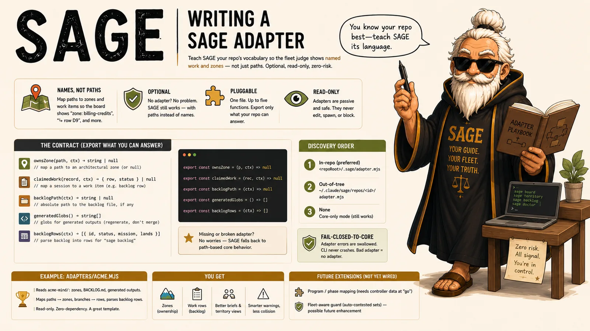

# Writing a SAGE adapter

<p align="center">
  <picture>
    <source srcset="assets/sage-adapters.avif" type="image/avif">
    <source srcset="assets/sage-adapters.webp" type="image/webp">
    
  </picture>
</p>

SAGE's **core** works on any repo with zero configuration — it reads git, tmux, the session
registry, and a generic handoff sidecar. An **adapter** is *optional* per-project enrichment: it
teaches SAGE your repo's vocabulary so the board and territory show **named work and zones**
("zone: `billing-credits`", "↳ row `D9`") instead of bare paths.

**A repo with no adapter is a first-class citizen.** Everything still works; warnings just
reference paths, not named rows or zones.

**Start here:** `sage adapter init` stamps a fully-commented no-op adapter at
`<repoRoot>/.agentic-sage/adapter.mjs` (from [`adapters/template.mjs`](./adapters/template.mjs)) —
fill in only what your repo can answer. The contract below explains each function;
[`adapters/acme.mjs`](./adapters/acme.mjs) is a complete worked example.

## The contract

An adapter is a single ES module exporting up to five functions. All are optional — export only
what your repo can answer. `ctx` is always `{ repoRoot }` (the absolute path to the repo root).

```js
// ownsZone(path, ctx) → string | null
//   Map a repo-relative path to an architectural-zone name (or null).
export const ownsZone = (p, ctx) => /* zone slug */ null

// claimedWork(record, ctx) → { row, status } | null
//   Map a session record (its `branch`, etc.) to a tracked work item.
//   `row` is the item id (e.g. a backlog row), `status` an optional glyph/label.
export const claimedWork = (rec, ctx) => /* { row: 'D9', status: '🟡' } */ null

// backlogPath(ctx) → string | null
//   Convenience for YOUR OWN functions (e.g. backlogRows) — the core never
//   calls this. Only backlogRows powers `sage backlog`.
export const backlogPath = (ctx) => null

// generatedGlobs() → string[]
//   Globs for THIS repo's generated outputs. A contested generated file is
//   flagged "regenerate, don't merge" instead of hand-merged.
export const generatedGlobs = () => []

// backlogRows(ctx) → [{ id, status, mission, lands }]
//   Parse the project's backlog file into rows so `sage backlog` can report who
//   holds each row + flag .md drift. `status` is the row's current glyph/checkbox
//   (✅/🟡/⬜); read it from the Status column, not the first glyph on the line.
//   Missing/garbage file → [] (fail-closed-to-empty; never throw). Absent ⇒ `sage
//   backlog` degrades to "no backlog adapter for this repo."
export const backlogRows = (ctx) => []
```

- **`backlogRows(ctx) → [{ id, status, mission, lands }]`** *(optional)* — parse the project's backlog
  file into rows so `sage backlog` can report who holds each row + flag `.md` drift. `status` is the
  row's current glyph/checkbox (`✅`/`🟡`/`⬜`); read it from the **Status column**, not the first glyph
  on the line. Missing/garbage file → `[]` (fail-closed-to-empty; never throw). Absent ⇒ `sage backlog`
  degrades to "no backlog adapter for this repo." The reference `adapters/acme.mjs` parses both the
  A/B/C checklist items and the Section-D table.

The core consumes four of these: `ownsZone`/`claimedWork` through the thin enrichment helpers in
`lib/adapter.mjs` (`zoneOf`, `rowOf`), and `backlogRows`/`generatedGlobs` directly from the CLI
(`sage backlog`, `sage merge-brief`). `backlogPath` is a private convenience for your own adapter
code — the core never invokes it. A missing export simply yields no enrichment for that dimension.

## Discovery order

When the CLI runs in a repo, it looks for an adapter in this order and uses the first it finds:

1. `<repoRoot>/.agentic-sage/adapter.mjs` — in-repo (the generic, committable location).
2. `<repoRoot>/.sage/adapter.mjs` — **legacy** read-alias (the pre-rename in-repo location; still
   discovered, but a fresh `sage adapter init` writes to slot 1 instead).
3. `<this repo's storage dir>/adapter.mjs` — out-of-tree (symlinked; keeps the adapter out of the
   project's own git history — see "Out-of-tree adapters" below). The storage dir is resolved
   through the same precedence chain as everything else (see `CONVENTIONS.md`) — by default
   `~/.claude/agentic-sage/repos/<repo-id>/adapter.mjs`.
4. none — core-only.

## Fail-closed-to-core

A broken, missing, or throwing adapter must **never** crash the CLI. `loadAdapter` dynamically
imports the module and returns `null` on any error; every enrichment helper swallows adapter
throws and falls back to the bare-path core behavior. So a bad adapter degrades gracefully to
exactly what you'd get with no adapter — it can't take SAGE down. Test your adapter, but know the
blast radius is contained by design.

## The handoff `project` blob

The generic handoff sidecar (`sage.handoff/1`) carries the universal core fields plus an **opaque
`project` object** the adapter may fill. The core never inspects `project` — it's a passthrough for
adapter-specific truth a future enrichment step can read. Keep core fields and project fields
separate; the core only ever reads the core fields.

## Glob dialect

Adapter globs use SAGE's dialect (shared with the guard and territory): `*` and `?` are the only
wildcards; `[ ] { }` are **literal** path characters (so a Next.js dynamic route `[channelSlug]`
matches itself, not a regex char-class). Brace expansion (`{a,b}`) is **not** supported — a brace
glob matches literally. Use `overlaps` from `lib/territory.mjs` if your adapter needs to match
paths against globs (the acme adapter does).

## Worked example — `adapters/acme.mjs`

The shipped reference adapter for the Acme project reads its Obsidian "Mind" vault under
`<repoRoot>/acme-mind/`:

- **`ownsZone(path, ctx)`** — scans `map/zones/*.md`, parses each zone's `owns.globs` list with a
  zero-dependency line scanner (no YAML lib), and returns the zone slug whose globs `overlaps` the
  path.
- **`claimedWork(rec, ctx)`** — matches the session's `branch` against the **Lands** column of
  `BACKLOG.md` rows (column index taken from each table's header, so a branch token in another
  cell can't false-claim a row; `main`/`master` never claims a code row), returning `{ row, status }`.
- **`backlogPath(ctx)`** — `<repoRoot>/acme-mind/BACKLOG.md` if present.
- **`generatedGlobs()`** — `payload-types.ts`, `importMap.js`, the Mind `map/index.md`, the visuals
  manifest — acme's regenerate-don't-merge outputs.

It is **read-only and zero-dependency** — a good template for your own.

### Out-of-tree adapters (the isolation pattern)

The acme adapter source lives **here, in `agentic-sage/adapters/`**, not in acme's own git
tree, and is symlinked to `~/.claude/agentic-sage/repos/<id>/adapter.mjs` (this repo's built-in
storage dir — see `CONVENTIONS.md` if a custom storage root is in play) for live use. This keeps
SAGE (meta-tooling) entirely out of the project it observes. If you'd rather version the adapter
with your project, just commit it at `<repoRoot>/.agentic-sage/adapter.mjs` (discovery slot 1) —
both work.

## Extension points (not yet wired)

- **`program` / `phase` / `claimed_globs` mapping** — richer than `claimedWork`'s `{row, status}`;
  needs the controller to register the session's program/phase at "go" (not derivable from git
  alone). A future contract addition.
- **Fleet-aware guard** — an adapter-supplied contested set. The guard is deliberately a
  *manual* human-curated list today (see `CONVENTIONS.md` and decision `0083`); auto-deriving it
  from other sessions' claims is a possible future enhancement, not the current contract.
